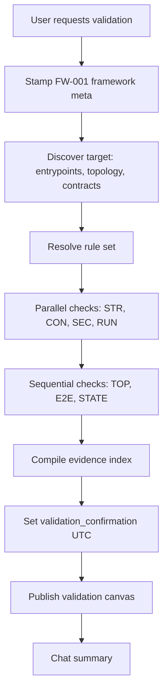

# Usage guide — BlankVisuals© Validator (FW-001)

This guide is for **humans** running validation in Cursor. The agent follows [SKILL.md](../SKILL.md); rules are defined in [reference.md](../reference.md).

## Prerequisites

- **Cursor** with Agent mode and skills enabled
- This skill installed under `~/.cursor/skills/blankvisuals-validator/` or `.cursor/skills/blankvisuals-validator/` in your project
- A **target** to validate: a repo or agent workflow built on (or claiming) framework **FW-001**

## Install the skill

```bash
# Personal (all projects)
git clone https://github.com/YOUR_USERNAME/blankvisuals-validator ~/.cursor/skills/blankvisuals-validator

# Or symlink an existing clone
ln -s /path/to/blankvisuals-validator ~/.cursor/skills/blankvisuals-validator
```

Restart or open a new Cursor chat if the skill does not appear in behavior immediately.

## Start a validation run

Open the target workspace, then use natural language. The skill triggers on phrases like *framework validation*, *BlankVisuals*, *orchestrator*, or */validate*.

### Example prompts

**Full repo validation**

```text
Run BlankVisuals© Validator (FW-001) on this repository.
Use precise & verify. Produce the validation canvas and chat summary.
```

**Agent / skill chain only**

```text
Validate the agent defined in AGENTS.md and all SKILL.md files against FW-001.
Classify framework type (skill-chain, subagent-graph, etc.) first.
```

**Scoped domain**

```text
FW-001 security pass only: SEC-01, SEC-02, SEC-03, SEC-MCP.
Evidence required for every rule; mark unknowns INCONCLUSIVE.
```

**With custom repo rules**

```text
Validate against VALIDATION.md in this repo, then fill gaps with reference.md rules.
```

### What happens during a run



Progress checklist the agent should follow:

1. Record framework meta (FW-001)
2. Discover target (type, entrypoints, artifacts)
3. Resolve rule set
4. Run independent checks (parallel where possible)
5. Run dependent checks (topology, E2E, integration)
6. Compile evidence index (`precise & verify`)
7. Set `validation_confirmation.confirmed_at` (ISO-8601 UTC)
8. Publish validation canvas

## Rule resolution priority

When rules conflict, higher priority wins:

1. Rules you state in the **current message**
2. Repo spec: `VALIDATION.md`, `docs/validation.md`, `.cursor/validation/`
3. Built-in catalog in [reference.md](../reference.md)

Each active rule should appear in the report with an ID (e.g. `TOP-02`, `SEC-01`).

## Discovery minimum

Before any `PASS`/`FAIL`, the agent should locate:

| Artifact | Typical locations |
|----------|-------------------|
| Entrypoints | `AGENTS.md`, `CLAUDE.md`, `SKILL.md`, hooks, SDK `Agent.*`, workflow YAML |
| Topology | Subagent types, skill chains, hook order, MCP servers |
| Contracts | Schemas, typed I/O, manifest fields, required env vars |
| State | Session/resume IDs, checkpoints, shared mutable stores |

Record at least: `target_name`, `framework_type`, `repo_root`, `entrypoints[]`, `built_on_fw_001`.

## Evidence standard

A rule is **verified** only with at least one of:

- **Command** — exit code + relevant stdout/stderr snippet
- **File** — path, line range, quoted excerpt
- **Tool** — MCP or other tool result identifier

If evidence cannot be obtained, status must be **`INCONCLUSIVE`**, never `PASS`.

Example evidence block:

```yaml
rule_id: STR-01
framework_id: FW-001
status: PASS
summary: All declared entrypoints exist on disk.
evidence:
  - type: file
    detail: "AGENTS.md:12 — lists skills/foo/SKILL.md; file present"
severity: minor
```

## Deliverables

### 1. Validation canvas (required)

- **Path:** `canvases/blankvisuals-validation-<target-slug>.canvas.tsx`
- **Header:** FW-001 meta + `validation_confirmation` + overall status
- **Body:** Stats, rule table, failed/inconclusive evidence, remediation list

Use **real data only** from the evidence index.

### 2. Chat summary

Template:

```markdown
## BlankVisuals© Validator — [target name]

**Framework:** FW-001 · v1.0.2 · registered 2026-05-20  
**Confirmed:** <ISO-8601 UTC> · precise & verify  
**Overall:** PASS | FAIL | INCONCLUSIVE  
**Rules:** N pass · M fail · K inconclusive (of T)

Open the canvas for full evidence. Critical failures: [rule_ids or "none"].
```

### Overall result

| Result | Condition |
|--------|-----------|
| **PASS** | Zero critical and major `FAIL` |
| **PASS with warnings** | Only minor `FAIL` |
| **FAIL** | Any critical or major `FAIL` |
| **INCONCLUSIVE** | Blocking unknowns on critical/major rules |

Severity definitions: [reference.md — Severity](../reference.md#severity).

## Custom validation rules

Add `VALIDATION.md` at the repo root (or `docs/validation.md`) to override or extend FW-001:

```markdown
## Framework
id: FW-001
name: BlankVisuals© Validator
version: v1.0.2
type: skill-chain | subagent-graph | mcp-orchestration

## Rules
- id: CUSTOM-01
  check: Every skill has a test fixture under tests/skills/
  pass: Fixture exists and runs green
  fail: Missing fixture or failing test

## Commands
verify: npm run validate
```

When `Source` or `Domain package` are set here, they override `cursor-skills` in framework meta for that run.

## Framework types

Classify the target before deep checks (multiple tags allowed):

| Type | Signals |
|------|---------|
| skill-chain | `SKILL.md`, skill frontmatter |
| hook-pipeline | `hooks.json`, hook scripts |
| subagent-graph | Task tool, `subagent_type`, resume |
| mcp-orchestration | MCP descriptors, `CallMcpTool` |
| sdk-automation | `@cursor/sdk`, `Agent.create` |
| heuristic-workflow | Prompt-only plans, checklists |
| plugin-marketplace | `.cursor-plugin`, manifest |

Full mapping to rule IDs: [reference.md — Framework taxonomy](../reference.md#framework-taxonomy).

## Parallel vs sequential checks

**Parallel** (independent domains, no shared mutable edits):

| Domain | Typical rules |
|--------|---------------|
| Structure | `STR-*` |
| Contracts | `CON-*` |
| Security | `SEC-*` |
| Runtime | `RUN-*` |

**Sequential** (after parallel pass):

- End-to-end: entrypoint → terminal condition
- Resume / interrupt semantics
- Cross-rule dependencies (e.g. manifest before marketplace checks)

One coordinator thread should merge subagent results and resolve conflicts (`PAR-02`).

## Subagent prompt templates

**Structure explorer**

```text
Target built on FW-001. Explore [repo_root] for entrypoints (skills, hooks, AGENTS.md, MCP, SDK).
Return: framework_type, entrypoints[], gaps vs STR-01/STR-03. Evidence only.
```

**Security explorer**

```text
Scan SEC-01/SEC-02/SEC-03. Return paths + excerpts. No PASS without evidence.
```

**Runtime shell**

```text
Run documented verify commands (read-only). Exit codes + last 30 lines. Map to RUN-*.
```

## Troubleshooting

| Problem | What to do |
|---------|------------|
| Skill not invoked | Mention *BlankVisuals*, *FW-001*, or *framework validation* explicitly |
| Early "PASS" | Ask to re-run with `precise & verify`; require evidence per rule |
| No canvas | Ask for `blankvisuals-validation-<slug>.canvas.tsx` in `canvases/` |
| Wrong rules | Add or fix `VALIDATION.md`; state priority in your prompt |
| Reserved path scanned | Exclude `~/.cursor/skills-cursor/` — validation must not target it |

## Further reading

- [SKILL.md](../SKILL.md) — agent orchestration and anti-patterns
- [reference.md](../reference.md) — complete rule catalog (META, STR, TOP, CON, PAR, STATE, SEC, OBS, RUN, DISC)
- [README.md](../README.md) — install and repo overview
